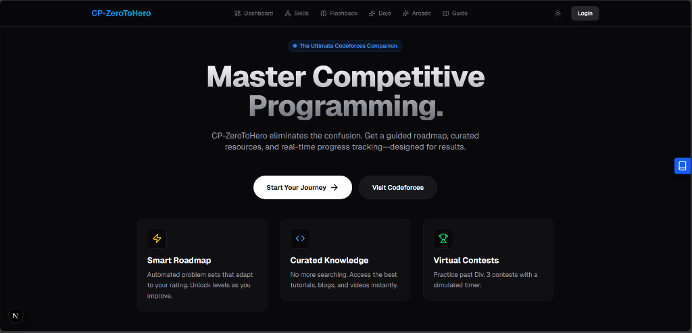

# CodeForge (CP-ZeroToHero) ⚔️

**The Ultimate Gamified Competitve Programming Training Platform.**

CodeForge turns your journey from "Newbie" to "Grandmaster" into an RPG. Track your XP, fight boss battles (hard problems), visualize algorithms, and get AI-powered mentoring without spoilers.



## 🚀 Key Features

### 1. The RPG Skill Tree (DAG) 🗺️
*   **Visual Roadmap:** Navigate a directed acyclic graph of CP topics (Binary Search → DP → Graphs).
*   **Progression:** Unlock new nodes by solving prerequisite problems.
*   **Boss Fights:** Clear "Boss Nodes" under time pressure to advance to the next sector.

### 2. The AI Dojo 🥋
*   **Code Surgeon:** Paste your broken code. The AI analyzes it and shows a "Diff View" of fixes without rewriting everything.
*   **Sensei Mode:** Stuck? Ask for a hint. The AI gently nudges you without spoiling the solution.
*   **Judge Watcher:** Real-time polling of Codeforces submissions.

### 3. Algorithm Studio 🎨
*   **Graph-O-Vision:** A CS-Academy style graph editor. Paste edge lists and see a **Static, Stable** force-directed layout.
*   **Array Animator:** Visualize sorting and searching algorithms step-by-step.
*   **Recursion Tree:** See the call stack of Fibonacci/DFS visually.

### 4. Flashback (The Ritual) 🕯️
*   **Spaced Repetition:** The app tracks your "Forgetting Curve".
*   **Daily Review:** You are prompted to re-solve problems 1 day, 3 days, and 1 week after solving them to ensure retention.

### 5. Mock Interviewer 🎙️
*   **Voice Mode:** A comprehensive mock interview simulation using Gemini.
*   **Live Coding:** Speak your thought process while coding in the shared editor.

### 6. Contest Calendar 🏆
*   **Aggregator:** See upcoming rounds from Codeforces, LeetCode, AtCoder, and CodeChef.
*   **Virtual Participation:** "Time Travel" to past contests and simulate them live.

---

## 🛠️ Tech Stack

*   **Framework:** Next.js 14 (App Router)
*   **Language:** TypeScript
*   **Styling:** Tailwind CSS + Framer Motion
*   **Database:** PostgreSQL (via Prisma ORM)
*   **Auth:** NextAuth (Google Provider)
*   **AI:** Groq SDK (Llama 3 70b)
*   **Visuals:** Vis.js (Graphs), React Flow (Skill Tree)

---

## ⚡ Getting Started

### Prerequisites
*   Node.js 18+
*   PostgreSQL Database

### Installation

1.  **Clone the repo**
    ```bash
    git clone https://github.com/yourusername/cp-zero-to-hero.git
    cd cp-zero-to-hero
    ```

2.  **Install dependencies**
    ```bash
    npm install
    # Note: If you face peer-dep issues with react-graph-vis:
    npm install --legacy-peer-deps
    ```

3.  **Setup Environment Variables**
    Create a `.env` file:
    ```env
    DATABASE_URL="postgresql://..."
    AUTH_SECRET="your-secret"
    GOOGLE_CLIENT_ID="..."
    GOOGLE_CLIENT_SECRET="..."
    GROQ_API_KEY="..."
    ```

4.  **Run Database Migrations**
    ```bash
    npx prisma generate
    npx prisma db push
    ```

5.  **Start the Server**
    ```bash
    npm run dev
    ```

Visit `http://localhost:3000` and start your journey!

---

## 📂 Project Structure

```
/app
  /api          # Next.js API Routes (AI, Auth, Judge)
  /dashboard    # Main User Hub
  /dojo         # AI Mentorship Page
  /studio       # Algorithm Visualizers
  /guide        # User Manual
/components
  /features     # Complex Features (GraphVis, InterviewRoom)
  /layout       # Navbar, Sidebar
/lib
  /prisma       # DB Client
  /gemini       # AI Integration (Legacy)
  /groq         # AI Integration (Active)
```

---

## 🛡️ License

MIT. Build something great.
